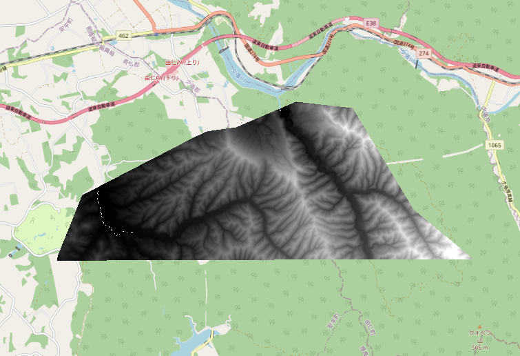

# lem2geotiff-cpp

LEM形式からGeoTIFF形式への変換ツール（C++実装、CUDA対応）

## ダウンロード

ビルド済みの実行ファイルは[Releases](https://github.com/gurneri009/lem2geotiff-cpp/releases)ページからダウンロードできます。

| プラットフォーム | ファイル |
|-----------------|---------|
| Windows (x64) | `lem2geotiff-cpp-windows-x64.zip` |
| Linux (x64) | `lem2geotiff-cpp-linux-x64.tar.gz` |
| Linux (x64, CUDA) | `lem2geotiff-cpp-linux-x64-cuda.tar.gz` |
| macOS (ARM64) | `lem2geotiff-cpp-macos-arm64.tar.gz` |

## 特徴

- **CPU/GPUハイブリッド処理**: CUDAが利用可能で効果的な場合、自動的にGPUアクセラレーションを使用
- **インテリジェントフォールバック**: 最適化されたCPU実装へシームレスにフォールバック
- **マルチスレッドCPU**: Intel TBBとAVX2 SIMD最適化によるCPU処理
- **CUDAビルド**: CUDAサポートはオプション

## パフォーマンス

実装は自動的に最適な実行方法を選択します：

- **CUDA GPU**: 大規模データセットに使用（パース時>100万要素、変換時>25万要素）
- **CPU（TBB + AVX2）**: 小規模データセットまたはGPUが利用不可の場合に使用
- **自動フォールバック**: GPU処理が失敗した場合、自動的にCPUにフォールバック

> 小規模データセットではGPUオーバーヘッドがあるため、CPUの方が高速

## 必要要件

### 必須
- C++20対応コンパイラ（GCC 11以上またはClang 14以上）
- CMake 3.18以上
- GDAL 3.0以上
- Intel TBB

### オプション
- CUDA Toolkit 11.0以上（GPUアクセラレーション用）
- NVIDIA GPU（Compute Capability 6.0以上、Maxwell世代以降）

## ビルド方法

### CPUのみでビルド（デフォルト）

```bash
mkdir build && cd build
cmake .. -DCMAKE_BUILD_TYPE=Release
make -j$(nproc)
```

### CUDAサポート付きでビルド

```bash
mkdir build && cd build
cmake .. -DCMAKE_BUILD_TYPE=Release -DENABLE_CUDA=ON
make -j$(nproc)
```

### ビルドオプション

- `-DENABLE_CUDA=ON/OFF`: CUDAサポートの有効/無効（デフォルト: OFF）
- `-DCMAKE_BUILD_TYPE=Release/Debug`: ビルドタイプ
- `-DCMAKE_CUDA_ARCHITECTURES`: ターゲットGPUアーキテクチャ（デフォルト: "60;70;75;80;86;89;100"）

### カスタムCUDAアーキテクチャ

特定のGPUモデル向け：

```bash
# RTX 50xxシリーズ用（Blackwell - compute capability 10.0）現状はローカルコンパイル版のみ
cmake .. -DCMAKE_CUDA_ARCHITECTURES=100

# RTX 40xxシリーズ用（Ada Lovelace - compute capability 8.9）
cmake .. -DCMAKE_CUDA_ARCHITECTURES=89

# RTX 30xxシリーズ用（Ampere - compute capability 8.6）
cmake .. -DCMAKE_CUDA_ARCHITECTURES=86

# RTX 20xxシリーズ用（Turing - compute capability 7.5）
cmake .. -DCMAKE_CUDA_ARCHITECTURES=75

# 複数アーキテクチャ対応
cmake .. -DCMAKE_CUDA_ARCHITECTURES="75;80;86;89;100"
```

## 使用方法

実行ファイルはCUDAの有無に関わらず同じ方法で動作します：

```bash
./lem2geotiff_cpp -d <入力ディレクトリ> [オプション]
```

### コマンドラインオプション

| オプション | 説明 | デフォルト |
|-----------|------|-----------|
| `-d, --directory` | LEMファイルを含む入力ディレクトリ（必須） | - |
| `-n, --nodata` | NoData値 | -9999 |
| `-w, --workers` | 並列ワーカー数 | 4 |
| `-h, --help` | 使用方法を表示 | - |

### 使用例

```bash
# 基本的な使用方法
./lem2geotiff_cpp -d ./dem_data

# NoData値を指定
./lem2geotiff_cpp -d ./dem_data -n -9999

# ワーカー数を指定
./lem2geotiff_cpp -d ./dem_data -w 8
```

## 出力例


